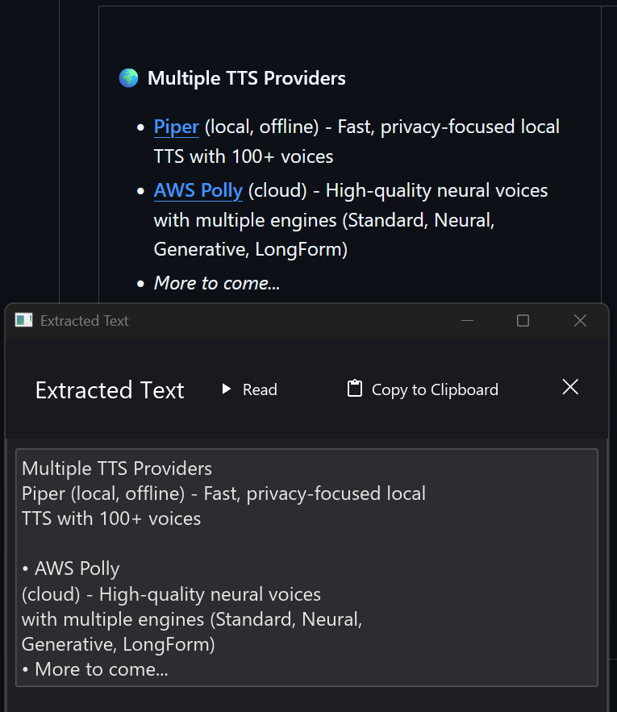

<div align="center">

<h1> Insight Reader</h1>

Insight Reader is a cross-platform text-to-speech app built with Tauri 2 + React/Vite.

</div>

Insight Reader reads text from clipboard selections, images, and screenshots. It supports offline voices through Piper, cloud voices through Microsoft Edge TTS, and optional AWS Polly support.

<br/>

<div align="center">


</div>

## Features

- Multiple voice providers:
  - Piper (local and offline)
  - Microsoft Edge TTS (cloud neural voices)
  - AWS Polly (optional)
- OCR support for reading text from images and screenshots:
  - Windows: native OCR APIs
  - macOS: Vision framework
  - Linux: EasyOCR workflow
- Floating desktop UI with playback controls and waveform visualization
- System tray integration with quick actions
- Global hotkey support (Windows and macOS; Linux depends on compositor setup)
- Cross-platform desktop bundles (Windows, macOS, Linux)

## Development

From repo root:

```bash
bun install
bun run tauri dev
```

Useful commands:

```bash
bun run dev          # frontend only
bun run build        # frontend build
bun run tauri build  # desktop bundles/installers
bun run test         # vitest tests
```

Rust checks (from `src-tauri`):

```bash
cargo fmt --all
cargo clippy --all-targets --all-features
cargo test
```

## Build notes

macOS universal build (Apple Silicon + Intel):

```bash
rustup target add aarch64-apple-darwin x86_64-apple-darwin
bun run tauri build --target universal-apple-darwin
```

If `tauri build` fails with `invalid value '1' for '--ci'`, run with `CI` unset:

```bash
# Bash/zsh
CI= bun run tauri build

# PowerShell
$env:CI=""; bun run tauri build

# CMD
set CI= && bun run tauri build
```

## Screenshots

<div align="center">

### Main Window


### OCR Capture


### Settings


### Voice Download


### Tray Integration
<table>
<tr>
<td align="center">
<strong>Windows</strong><br>

</td>
<td align="center">
<strong>macOS</strong><br>

</td>
</tr>
</table>

</div>

## AWS Polly setup (optional)

To use AWS Polly, configure credentials using one of these approaches:

1. Environment variables:

   ```bash
   export AWS_ACCESS_KEY_ID="your-access-key"
   export AWS_SECRET_ACCESS_KEY="your-secret-key"
   export AWS_REGION="us-east-1"
   ```

2. Credentials file (`~/.aws/credentials`):

   ```ini
   [default]
   aws_access_key_id = your-access-key
   aws_secret_access_key = your-secret-key
   ```

3. Named profile (`~/.aws/credentials`) and `AWS_PROFILE`.

## Troubleshooting

- No audio playback: verify system audio output is working.
- Clipboard read issues:
  - Windows: copy text before triggering read.
  - macOS: grant Accessibility permissions to the app/terminal.
- Linux tray icon missing: install appindicator/gtk tray dependencies for your distro.
- Linux global hotkeys on Wayland: configure compositor-specific key bindings.

## Acknowledgments

- Built with [Tauri](https://tauri.app/), [React](https://react.dev/), and [Rust](https://www.rust-lang.org/)
- Uses [Piper TTS](https://github.com/rhasspy/piper)
- Uses [Microsoft Edge TTS](https://github.com/rany2/edge-tts)
- Optional AWS Polly support via AWS SDK for Rust

---

<div align="center">

[Issues](https://github.com/gabepsilva/insight-reader/issues) • [Releases](https://github.com/gabepsilva/insight-reader/releases)

</div>
