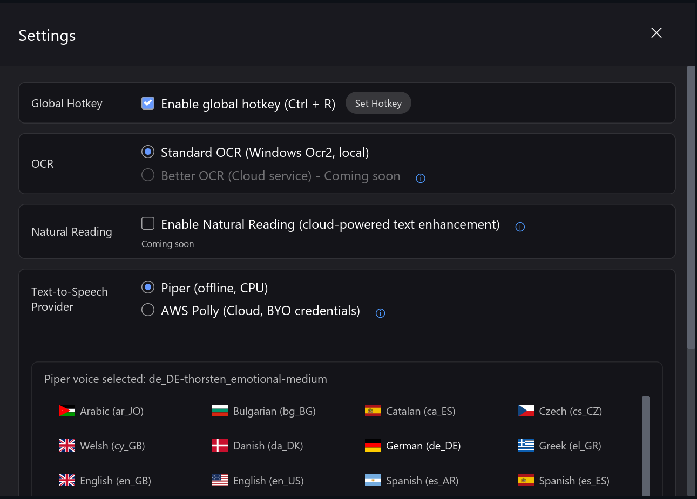
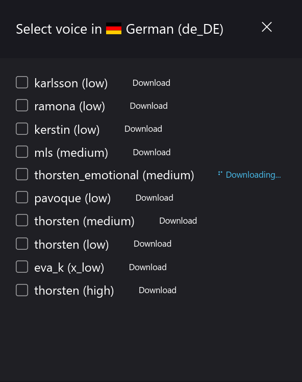
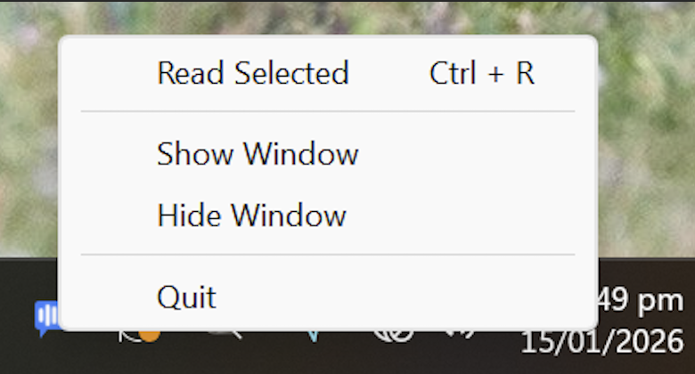
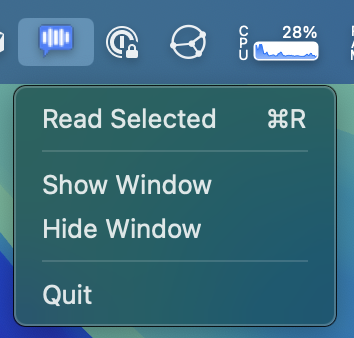
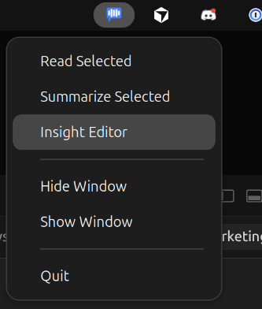

<div align="center">

<h1> Insight Reader</h1>

Insight Reader is a cross-platform text-to-speech app built with Tauri 2 + React/Vite.

</div>

Insight Reader reads text from clipboard selections. It supports offline voices through Piper, cloud voices through Microsoft Edge TTS, and optional AWS Polly support.

<br/>

<div align="center">


</div>

## Features

- **Read anything, from almost anywhere**
  - Reads from selected text or clipboard, so it works across browsers, PDFs, terminals, and native apps.
  - Fast, timeout-protected text capture keeps the app responsive even on slower systems.

- **Multiple voice providers**
  - **Piper** (local and offline)
  - **Microsoft Edge TTS** (cloud neural voices, default)
  - **AWS Polly** (optional, when credentials are configured)

- **Floating desktop player**
  - Always-on-top mini window with play/pause, stop, ±5s seek, volume, and speed control (0.75×–2×).
  - Dark/light themes with macOS-style window chrome and quick access to Settings.

- **Insight Editor (AI-assisted)**
  - Clean up text for reading, summarize, or explain in two modes (“Like I missed the meeting” / “Like high school”).
  - Rewrite with presets for **tone** (Professional, Friendly, Concise, Casual, Confident) and **format** (Email, IM/Slack, Document, Social with subtypes).
  - One-click quick edits (Make shorter, Simplify language, Add call to action, Fix grammar, More persuasive, Add subject line).
  - Built‑in grammar and style checking via Harper.js, with suggestions, dictionary, and ignore lists.

- **Tray and shortcuts**
  - System tray menu for **Read Selected**, **Summarize Selected**, and **Insight Editor** on Windows, macOS, and Linux.
  - Global hotkey support on Windows/macOS/X11, with a compositor-friendly model for Wayland (Hyprland, etc.).

- **Cross-platform desktop bundles**
  - Native installers for **Windows, macOS, and Linux**, with optional universal macOS (Apple Silicon + Intel) builds.

## Development

From repo root:

```bash
bun install
bun run tauri dev
```

Useful commands:

```bash
bun run dev          # frontend only
bun run build        # frontend build
bun run tauri build  # desktop bundles/installers
bun run test         # vitest tests
```

### Secrets scanning

- **CI**: All pushes and pull requests run a **Gitleaks** secret scan in the `Test` workflow. Any detected secrets will fail the workflow.
- **Optional local hook**:
  - Install `gitleaks` and `pre-commit` (e.g. via your package manager or `pip install pre-commit`).
  - From the repo root, run:

    ```bash
    pre-commit install
    ```

  - This will run Gitleaks as a pre-commit hook against staged changes.

Rust checks (from `src-tauri`):

```bash
cargo fmt --all
cargo clippy --all-targets --all-features
cargo test
```

## Build notes

macOS universal build (Apple Silicon + Intel):

```bash
rustup target add aarch64-apple-darwin x86_64-apple-darwin
bun run tauri build --target universal-apple-darwin
```

If `tauri build` fails with `invalid value '1' for '--ci'`, run with `CI` unset:

```bash
# Bash/zsh
CI= bun run tauri build

# PowerShell
$env:CI=""; bun run tauri build

# CMD
set CI= && bun run tauri build
```

## Screenshots

<div align="center">

### Main Window


### Settings


### Voice Download


### Tray Integration
<table>
<tr>
<td align="center">
<strong>Windows</strong><br>

</td>
<td align="center">
<strong>macOS</strong><br>

</td>
<td align="center">
<strong>Linux</strong><br>

</td>
</tr>
</table>

</div>

## AWS Polly setup (optional)

To use AWS Polly, configure credentials using one of these approaches:

1. Environment variables:

   ```bash
   export AWS_ACCESS_KEY_ID="your-access-key"
   export AWS_SECRET_ACCESS_KEY="your-secret-key"
   export AWS_REGION="us-east-1"
   ```

2. Credentials file (`~/.aws/credentials`):

   ```ini
   [default]
   aws_access_key_id = your-access-key
   aws_secret_access_key = your-secret-key
   ```

3. Named profile (`~/.aws/credentials`) and `AWS_PROFILE`.

## Linux Wayland global hotkeys

On Linux Wayland sessions, Insight Reader does not register traditional app-owned global hotkeys. Instead, configure your compositor or desktop environment to run Insight Reader actions:

- **Read selected text**: `insight-reader action read-selected`
- **Pause / resume**: `insight-reader action pause`
- **Stop**: `insight-reader action stop`

Make sure the `insight-reader` binary is on your `PATH` (for example, `~/.local/bin/insight-reader` when installing a local build), then bind your preferred key combinations to these commands in your compositor:

- **Hyprland example** (`~/.config/hypr/bindings.conf`):

  ```conf
  bindd = CTRL, R, Read selected text, exec, insight-reader action read-selected
  bindd = CTRL SHIFT, R, Pause or resume speech, exec, insight-reader action pause
  bindd = CTRL ALT, R, Stop speech, exec, insight-reader action stop
  ```

For other Wayland compositors or desktop environments (GNOME, KDE, etc.), create equivalent custom shortcuts that execute the same commands. All of these entrypoints trigger the same internal actions as the tray menu and native hotkeys on Windows/macOS/X11.

## Troubleshooting

- No audio playback: verify system audio output is working.
- Clipboard read issues:
  - Windows: copy text before triggering read.
  - macOS: grant Accessibility permissions for reading selected text.
- Linux tray icon missing: install appindicator/gtk tray dependencies for your distro.
- Linux global hotkeys on Wayland: configure compositor-specific key bindings.

## Acknowledgments

- Built with [Tauri](https://tauri.app/), [React](https://react.dev/), and [Rust](https://www.rust-lang.org/)
- Uses [Piper TTS](https://github.com/rhasspy/piper)
- Uses [Microsoft Edge TTS](https://github.com/rany2/edge-tts)
- Optional AWS Polly support via AWS SDK for Rust

---

<div align="center">

[Issues](https://github.com/gabepsilva/insight-reader/issues) • [Releases](https://github.com/gabepsilva/insight-reader/releases)

</div>