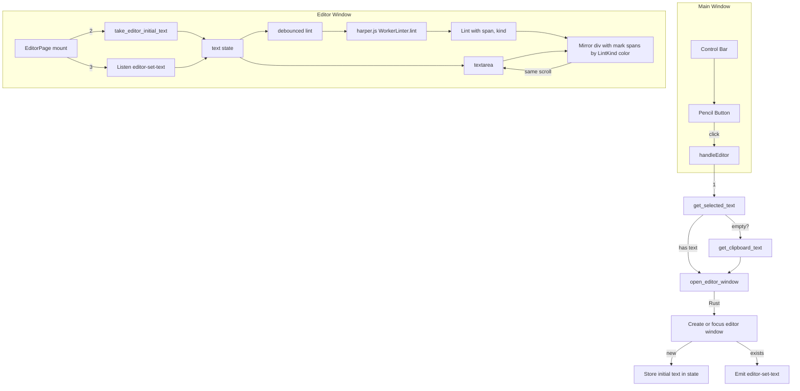

# Grammar Editor Window (Harper)

> Replace the clipboard button with a pencil/edit button that opens a second Tauri window: a mini grammar editor powered by Harper.js. The editor is pre-filled with selected text (or clipboard as fallback), uses a textarea + overlay for highlight spans, and maps Harper LintKind to colors.

---

## Todos

| ID | Task | Status |
|----|------|--------|
| m1-clipboard-fn | M1.1–1.2: get_clipboard_text in system/clipboard and Tauri command | done |
| m1-editor-window | M1.3–1.4: open_editor_window, take_editor_initial_text, state and emit | done |
| m2-pencil-button | M2.1–2.3: PencilIcon, replace clipboard button, handleEditor | done |
| m3-editor-entry | M3.1–3.3: editor.html, editor-main.tsx, Vite input | done |
| m3-editor-page | M3.4–3.5: EditorPage mount, take/listen, textarea + mirror (no Harper) | done |
| m4-harper | M4.1–4.4: harper.js dep, WorkerLinter, debounced lint, LintKind→color map | pending |
| m5-overlay | M5.1–5.3: renderMirrorContent with marks, CSS classes, legend | pending |
| m6-polish | M6.1–6.3: window options, EditorPage layout, re-open/focus behavior | pending |

---

## Architecture

---

## Milestone 1: Backend — clipboard and editor window

**Goal:** Tauri commands and state to open the editor window and pass initial text.

- [x] **1.1** Add `get_clipboard_text()` in `src-tauri/src/system/clipboard/mod.rs`: use `arboard::Clipboard::new()?.get_text()`; on Linux use the explicit clipboard buffer (e.g. `get().clipboard(LinuxClipboardKind::Clipboard).text()` or equivalent) so it matches Ctrl+C, not PRIMARY. Process with `process_text` and return `Option<String>`. Export in `src-tauri/src/system/mod.rs`.
- [x] **1.2** In `src-tauri/src/lib.rs`: add `#[tauri::command] fn get_clipboard_text() -> Option<String>` that calls `system::get_clipboard_text`; register in `invoke_handler`.
- [x] **1.3** Add shared state for editor initial text: e.g. `Arc<Mutex<Option<String>>>` in `lib.rs` and provide via `tauri::manage`. Add `#[tauri::command] fn open_editor_window(app: AppHandle, initial_text: String) -> Result<(), String>` that: (a) stores `initial_text` in that state; (b) gets existing webview with label `"editor"` via `app.get_webview_window("editor")`; (c) if exists: `emit` to `"editor"` the event `editor-set-text` with `initial_text`, then `set_focus()`; (d) if not: create `WebviewWindow` with `WebviewWindowBuilder` — label `"editor"`, title `"Grammar"`, size ~500x400, resizable, `decorations: true`. URL: in dev use `WebviewUrl::External` with `{dev_url}/editor.html` from `app.config().build.dev_url` (or `http://localhost:1420/editor.html`); in release `WebviewUrl::App("/editor.html".into())`. Register `open_editor_window`.
- [x] **1.4** Add `#[tauri::command] fn take_editor_initial_text(state: State<Arc<Mutex<Option<String>>>>) -> Option<String>` that locks, takes the value, and returns it. Register in `invoke_handler`.

**Files:** `src-tauri/src/lib.rs`, `src-tauri/src/system/clipboard/mod.rs`, `src-tauri/src/system/mod.rs`, `src-tauri/src/system/clipboard/linux.rs` (if needed for Linux).

---

## Milestone 2: Frontend — main bar (button and handler)

**Goal:** Pencil button that gathers selected or clipboard text and opens the editor.

- [x] **2.1** Create `src/components/icons/PencilIcon.tsx` (or `EditIcon.tsx`): simple pencil SVG, same `IconProps` as other icons. Export from `src/components/icons/index.ts`.
- [x] **2.2** In `src/App.tsx`: replace the clipboard button’s SVG with `PencilIcon` (or inline pencil SVG). Change `className` from `clipboard` to `editor` (or `grammar`); update `src/App.css` to use `.control-button.editor` (or `.grammar`). Set `aria-label` to `"Open grammar editor"`.
- [x] **2.3** Rename `handleClipboard` to `handleEditor`. Implement: `const sel = await invoke<string | null>("get_selected_text"); const text = (sel != null && sel.length > 0) ? sel : (await invoke<string | null>("get_clipboard_text")) ?? ""; await invoke("open_editor_window", { initialText: text });`. Wire `onClick={handleEditor}`. Add a minimal `try/catch` and `console.warn` on failure.

**Files:** `src/App.tsx`, `src/App.css`, `src/components/icons/PencilIcon.tsx`, `src/components/icons/index.ts`.

---

## Milestone 3: Editor page — Vite entry and shell

**Goal:** Second HTML entry and EditorPage that receives initial text and renders textarea + mirror (no Harper yet).

- [x] **3.1** Add `editor.html` at project root: same structure as `index.html`, ``, root `id="root"`.
- [x] **3.2** Add `src/editor-main.tsx`: same as `main.tsx` but render `<EditorPage />` instead of `<App />`.
- [x] **3.3** In `vite.config.ts`: set `build.rollupOptions.input: { main: resolve(__dirname, 'index.html'), editor: resolve(__dirname, 'editor.html') }` so `dist/editor.html` is produced.
- [x] **3.4** Create `src/EditorPage.tsx` (or `src/pages/EditorPage.tsx`). On mount: (a) `invoke<string | null>("take_editor_initial_text")` and set `initialText` in state (use `""` if null); (b) `listen("editor-set-text", (e) => setText(e.payload))` and store the listener (cleanup on unmount). State: `text: string`.
- [x] **3.5** Render: a wrapper with a `<textarea>` (controlled, `value={text}`, `onChange` updates state) and a **mirror div** behind it: same font, `white-space: pre-wrap`, same width/padding, `pointer-events: none`, `aria-hidden`. Mirror content: `text` escaped (no marks yet). Use a layout: mirror and textarea in a scroll-synced container; textarea has `background: transparent` and is absolutely overlayed on the mirror so they align. Sync `scrollTop`/`scrollLeft` of textarea to the mirror on scroll. For this milestone the mirror shows plain escaped text only.

**Files:** `editor.html`, `src/editor-main.tsx`, `src/EditorPage.tsx`, `vite.config.ts`.

---

## Milestone 4: Harper.js integration

**Goal:** Run Harper on the text and obtain spans with LintKind for highlighting.

- [ ] **4.1** Add `harper.js` to `package.json`. If it depends on WASM, ensure `tauri.conf.json` CSP allows it (e.g. `script-src ... 'wasm-unsafe-eval'` if required).
- [ ] **4.2** In `EditorPage`: create a `WorkerLinter` (or `LocalLinter` if Worker is not needed) using Harper’s browser API. Use `harper.binary` and a dialect (e.g. `harper.Dialect.American`). Lazy-init on first lint.
- [ ] **4.3** On `text` change: debounce (e.g. 300–400 ms), then `linter.lint(text)`. Collect `Lint[]`; for each `lint` call `lint.span()` for `{ start, end }` and, if exposed, `lint.kind()` or equivalent for `LintKind`. Store `lints: Array<{ start: number, end: number, kind?: string }>` in state. If the JS API does not expose `kind`, use `message()` or a default and map to a single "grammar" category for v1.
- [ ] **4.4** Build a `LintKind -> color` map (e.g. Spelling: red, Grammar: orange, Punctuation: gray, Capitalization: gold, Style/Enhancement: blue, others: gray). Use a small set so the legend stays simple.

**Files:** `package.json`, `src/EditorPage.tsx`, `tauri.conf.json` (CSP if needed).

---

## Milestone 5: Overlay highlights and legend

**Goal:** Mirror div shows `<mark>` (or ``) around each lint span with a class/color by LintKind; legend lists categories.

- [ ] **5.1** In `EditorPage`: implement `renderMirrorContent(text: string, lints: LintEntry[])`: escape `text` (replace `&`, `<`, `>`), then for each lint (sorted by `start`), insert `<mark class="lint lint--{kind}" data-start="{start}" data-end="{end}">` around the substring from `start` to `end`. Use `lint--spelling`, `lint--grammar`, `lint--punctuation`, etc., from the LintKind map. Assume non-overlapping spans; if overlaps exist, take the first.
- [ ] **5.2** Add CSS for `.lint--spelling`, `.lint--grammar`, `.lint--punctuation`, `.lint--capitalization`, `.lint--style` (or `.lint--enhancement`), `.lint--misc` (fallback): e.g. `background` or `border-bottom` with distinct colors. Ensure marks do not change line layout (inline only, no extra padding that would misalign with the textarea).
- [ ] **5.3** Add a small legend below or beside the editor: e.g. "Spelling", "Grammar", "Punctuation", "Style" with a swatch each. Reuse the same class names or a mapping.

**Files:** `src/EditorPage.tsx`, `src/EditorPage.css` or inline/styles.

---

## Milestone 6: Editor window and UX polish

**Goal:** Correct window options, styling, and re-use behavior.

- [ ] **6.1** In `open_editor_window` (Rust): ensure the editor window has `decorations: true`, `resizable: true`, `min_inner_size` if desired (e.g. 400x300), and a sensible `center()` or default position. Title: `"Grammar"` or `"Insight — Grammar"`.
- [ ] **6.2** EditorPage: basic layout (padding, font-size, line-height) so the textarea and mirror are readable. Ensure the scroll-sync works when the content is taller than the viewport.
- [ ] **6.3** If the editor window is already open and the user clicks the pencil again with new selected/clipboard text: the `editor-set-text` flow already replaces the content; confirm focus and that the new text is linted after a short delay.

**Files:** `src-tauri/src/lib.rs`, `src/EditorPage.tsx`, `src/EditorPage.css`.

---

## Dependencies

- **Rust:** `arboard` already in `src-tauri/Cargo.toml`. No new crates for M1.
- **JS:** `harper.js` (M4). Tauri `@tauri-apps/api` already includes `invoke`, `listen`, and `window`/`webviewWindow`; for creating the window from Rust we use `tauri::WebviewWindowBuilder`.

---

## Risk and notes

- **Editor URL in dev vs prod:** The exact `WebviewUrl::External` in dev may need to match `beforeDevCommand` / port (1420). If `dev_url` from config omits the path, append `/editor.html`.
- **Harper.js API:** If `WorkerLinter` setup differs (e.g. worker path, binary loading), follow `harper.js` docs. `lint.span()` returns `{ start, end }`; `lint.kind()` or a `rule`/`lint_kind` field may need to be inferred from the published API.
- **Linux clipboard:** For `get_clipboard_text`, prefer the explicit clipboard (Ctrl+C). `arboard` on Linux: `get().clipboard(LinuxClipboardKind::Clipboard).text()` or the default `get_text()` depending on what `get_text()` targets; implement and test on Linux.
